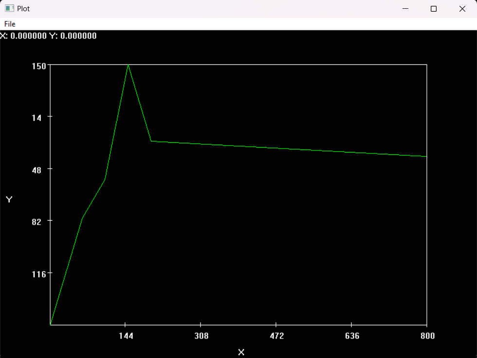

# RnPlot32

## About

This is a header-only 2D C++ plotting library for Windows meant to provide basic line plotting for quick visualization of real-number datasets. It is intended to be simple to use and is designed to work without needing any third party libraries or tools installed. It also includes a print and export feature to save plots as .png files and export to CSV files respectively.

## Requirements

- **Operating System**: Windows
- **Compiler**: Any C++ compiler that supports the Win32 API (e.g., MSVC, MinGW)

## Usage

1. **Include the rnplot32 header found in `src/`**
2. **Use the `WinMain` function as the entry point for your application**
3. **Build your project with the Windows subsystem:**
    - In your project settings, set the **Linker System** to **Windows**.

## Example

```cpp

#include "rnplot32.h"

int WINAPI WinMain(HINSTANCE hInstance, HINSTANCE hPrevInstance, PWSTR pCmdLine, int CmdShow)
{
    // Create dataset as 2-D vector of any numeric type
    std::vector<float> x;
    std::vector<float> y;

    // Call plot function with default labels ('x', 'y') and default tile ('Plot')
    rnplot32::Plot2D plot(x, y);
    plot.Show();

    // Call plot function with custom axis labels and title
    rnplot32::Plot2D plot(x, y, "distance", "time", "Distance vs Time");
    plot.Show();
}

```

**Sample plot:**



## License

This project is licensed under the MIT License.
