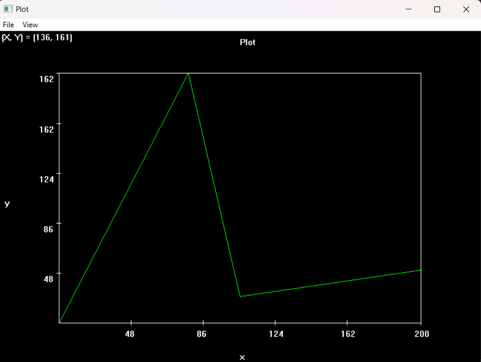

# cpplot2d

> [!IMPORTANT]
> **Project Status: In Progress**
> _This project is actively being developed. Some features are incomplete or experimental._

## About

**cpplot2d** is a cross-platform, header-only 2D plotting library for C++ designed for speed and simplicity. The library is:

- Easy to use with a single header file to include and simple API
- Self-contained (no external dependencies)
- Capable of displaying plots or saving them as `.png` images
- Responsive even with large datasets

## Requirements

- **Operating System**: Windows, MacOs, Linux
- **Compiler**: Any C++ compiler

## Usage

### Windows/Linux

Simply copy the header file from `include/cpplot2d.h` and include it in your project and define the macro `CPPLOT2D_IMPLEMENTATION` once before the inlcude statement. Only in **one** C++ source file (`.cpp` or `.cxx`), you must define the implementation macro before including the header. This generates the function definitions.

```cpp
#define CPPLOT2D_IMPLEMENTATION  // In ONE file only (e.g., main.cpp or cpplot2d_impl.cpp)
#include "cpplot2d.h"
```

In all other files, simply include the header as needed:

```cpp
// In all other files
#include "cpplot2d.h"
```

### Apple

The macOS backend uses the Cocoa API, which requires the Objective-C++ compiler.

1. Install Command Line Tools: Install the necessary compiler and SDK components if you do not already have them:

```bash
xcode-select --install
```

2. Create an Implementation File: You must define the implementation macro in a source file that is compiled as Objective-C++ (by using the `.mm` extension).

```cpp
// In ONE file only (must be a .mm file on macOS. e.g., main.mm or cpplot2d_impl.mm)
#define CPPLOT2D_IMPLEMENTATION
#include "cpplot2d.h"
```

Then in your other files, simply include the `cpplot2d.h` header as needed.

```cpp
// In all other files
#include "cpplot2d.h"
```

## Examples

### Simple line plot

```cpp

#include "cpplot2d.h"

int main()
{
    // Create dataset as 2-D vector of any numeric type
    std::vector<float> x = {1,2,3};
    std::vector<float> y = {1,2,3};

    // Create plot object and add a line 
    cpplot2d::Plot2D plot;
    plot.AddLine(x, y, cpplot2d::Color::FromRGB(0, 255, 0));
    
    // Show the plot
    plot.Show();

}
```

### Multiple Lines

```cpp

#include "cpplot2d.h"

int main()
{
    // Create datasets
    std::vector<float> x1 = {1,2,3};
    std::vector<float> y1 = {1,2,3};
    std::vector<float> x2 = {4,5,6};
    std::vector<float> y2 = {4,5,6};

    // Create plot object and add 2 lines 
    cpplot2d::Plot2D plot;
    plot.AddLine(x1, y1, cpplot2d::Color::FromRGB(0, 255, 0))
        .AddLine(x2, y2, cpplot2d::Color::FromRGB(255, 255, 0));
    
    // Show the plot
    plot.Show();

}
```

---

**Sample plot:**



---

## Contributing

Contributions are welcome! Please follow these steps when contributing:

### Code Style

This project uses clang-format for consistent code style.

- Ensure code is formatted before submitting a pull request
- The formatting configuration is defined in the .clang-format file in the repo root

To format your code automatically:

```sh
clang-format -i path/to/file.cpp
```

A handy git alias to format all staged files with a simple "format" command:

```sh
alias format="git diff --cached --name-only --diff-filter=ACMRTUXB | grep -E '\.(cpp|cc|c|h|hpp)$' | xargs clang-format -i"
```

### Testing

Unit tests are located in the tests/ directory. (WIP — contributions welcome.)

## License

MIT License with Attribution Clause  

Copyright (c) 2025 Brody Clark  

Permission is hereby granted, free of charge, to any person obtaining a copy  
of this software and associated documentation files (the "Software"), to deal  
in the Software without restriction, including without limitation the rights  
to use, copy, modify, merge, publish, distribute, sublicense, and/or sell  
copies of the Software, subject to the following conditions:  

1. **Attribution Requirement**  
   Any use of this Software, including in original or modified form, must include  
   proper attribution to the original author(s) as follows:  
   - The author's name must be credited in the accompanying documentation, README,  
     or other relevant written materials.  
   - If the Software is used in a user-facing application (such as a website, game,  
     or graphical software), an attribution notice must be visible within the UI,  
     such as in an "About" section or equivalent location.  

2. **Derivative Works**  
   Any modified or derivative works of this Software must include a prominent notice  
   stating that the work is derived from this Software and must also comply with  
   the attribution requirements above.  

3. **Preservation of License**  
   This license notice, including the attribution requirement, must be included in  
   all copies or substantial portions of the Software.  

THE SOFTWARE IS PROVIDED "AS IS", WITHOUT WARRANTY OF ANY KIND, EXPRESS OR IMPLIED,  
INCLUDING BUT NOT LIMITED TO THE WARRANTIES OF MERCHANTABILITY, FITNESS FOR A  
PARTICULAR PURPOSE, AND NONINFRINGEMENT. IN NO EVENT SHALL THE AUTHORS OR COPYRIGHT  
HOLDERS BE LIABLE FOR ANY CLAIM, DAMAGES, OR OTHER LIABILITY, WHETHER IN AN ACTION  
OF CONTRACT, TORT, OR OTHERWISE, ARISING FROM, OUT OF, OR IN CONNECTION WITH THE  
SOFTWARE OR THE USE OR OTHER DEALINGS IN THE SOFTWARE.  