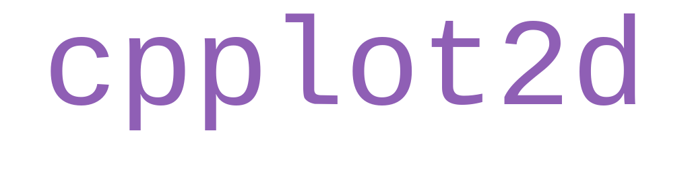
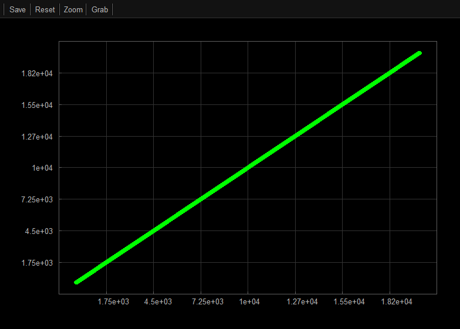

<p align="center">
  
</p>


<p align="center">
  
</p>

## About

**cpplot2d** is a cross-platform, single header-only 2D plotting library for C++ designed for quick data visualization. The library is:

- Easy to use (a single header file to include and simple API)
- Self-contained (no external dependencies)
- Capable of displaying **line** and **scatter** plots or saving them as images (**_.png_** on **Windows/Apple** and **_.ppm_** on **Linux**)
- Equipped with panning and zooming features
- Responsive even with large datasets

## Requirements

- **Operating System**: Windows, MacOs, Linux
- **Compiler**: Any C++ compiler

## Usage

This library is contained a single header file located at `include/cpplot2d.h`, you can also [download the latest stable release here](https://github.com/Brody-Clark/cpplot2d/releases/latest/download/cpplot2d.h).

### Windows/Linux

Simply copy the `cpplot2d.h` header file, include it in your project, and define the macro `CPPLOT2D_IMPLEMENTATION` **once** before the inlcude statement. Only in **one** C++ source file (`.cpp` or `.cxx`), you must define the implementation macro before including the header. This generates the function definitions.

```cpp
#define CPPLOT2D_IMPLEMENTATION  // In ONE file only (e.g., main.cpp or cpplot2d_impl.cpp)
#include "cpplot2d.h"
```

In all other files, simply include the header as needed:

```cpp
// In all other files
#include "cpplot2d.h"
```

### Apple

The macOS backend uses the Cocoa API, which requires the Objective-C++ compiler.

1. Install Command Line Tools: Install the necessary compiler and SDK components if you do not already have them:

```bash
xcode-select --install
```

2. Create an Implementation File: You must define the implementation macro in a source file that is compiled as Objective-C++ (by using the `.mm` extension).

```cpp
// In ONE file only (must be a .mm file on macOS. e.g., main.mm or cpplot2d_impl.mm)
#define CPPLOT2D_IMPLEMENTATION
#include "cpplot2d.h"
```

Then in your other files, simply include the `cpplot2d.h` header as needed.

```cpp
// In all other files
#include "cpplot2d.h"
```
## Building

Because **cpplot2d** uses the native windowing systems of each OS to stay dependency-free, you must link the corresponding system libraries during compilation.

### Linux (X11)

On Linux, the library interfaces with the X Window System. You must link the `X11` library.

```bash
g++ main.cpp -lX11 -o my_plot
```

### Windows (GDI/User32)

On Windows, the library uses the Win32 API. Most compilers link these by default, but if you are using MinGW or a strict manual build, ensure you link `gdi32` and `user32`.

**MinGW / GCC:**

```bash
g++ main.cpp -lgdi32 -luser32 -o my_plot.exe
```

**MSVC (Command Line):**

```bash
cl main.cpp user32.lib gdi32.lib
```

### macOS (Cocoa/Quartz)

As noted in the Usage section, macOS requires the Objective-C++ compiler (`clang++`) and linking against the `Cocoa` and `CoreGraphics` frameworks. Ensure your implementation file has a `.mm` extension.

```bash
clang++ main.mm -framework Cocoa -framework CoreGraphics -o my_plot
```

## Examples

### Line plot

```cpp

#include "cpplot2d.h"

int main()
{
    // Create dataset as 2-D vector of any numeric type
    std::vector<float> x = {1,2,3};
    std::vector<float> y = {1,2,3};

    // Create plot object and add a line 
    cpplot2d::Plot2D plot;
    plot.AddLine(x, y);
    
    // Show the plot
    plot.Show();

}

```
### Scatter plot

```cpp

#include "cpplot2d.h"

int main()
{
    // Create datasets
    std::vector<float> x = {1,2,3};
    std::vector<float> y = {1,2,3};

    cpplot2d::Plot2D plot;
    plot.AddPoints(x, y);
    
    // Show the plot
    plot.Show();
}

```

### Line and Scatter plots with Custom Styles

```cpp

#include "cpplot2d.h"

int main()
{
    // Create datasets
    std::vector<float> x1 = {1, 2, 3};
    std::vector<float> y1 = {1, 2, 3};
    std::vector<float> x2 = {4, 5, 6};
    std::vector<float> y2 = {4, 5, 6};

    // Create plot object with custom label and add 2 lines with custom styles
    cpplot2d::Plot2D plot("Title", "X Label", "Y Label");

    // Style for scatter series
    cpplot2d::ScatterStyle scatterStyle;
    scatterStyle.radius = 3;
    cpplot2d::ScatterProperties scatterProps;
    scatterProps.style = scatterStyle;
    scatterProps.label = "My Scatter";

    // Style for line series
    cpplot2d::LineStyle lineStyle;  
    lineStyle.thickness = 1;
    cpplot2d::LineProperties lineProps;
    lineProps.style = lineStyle;
    lineProps.label = "My Line";

    // Add Series with their custom properties
    plot.AddPoints(x1, y1, scatterProps).AddLine(x2, y2, lineProps);

    // Show the plot
    plot.Show();

}
```

### Plot with Custom Properties

```cpp

#include "cpplot2d.h"

int main()
{
    // Create datasets
    std::vector<float> x1 = {1,2,3};
    std::vector<float> y1 = {1,2,3};

    // Create plot object with High Contrast theme, no grid lines, and visible plot legend
    cpplot2d::PlotProperties props;
    props.theme = cpplot2d::Theme::HighContrast();
    props.showLegend = true;
    props.showGridLines = false;

    cpplot2d::Plot2D plot("my plot", "X", "Y", props);
    plot.AddPoints(x1, y1);
    
    // Show the plot
    plot.Show();
}
```

---

## Contributing

Contributions are welcome. Please see [CONTRIBUTING.md](./CONTRIBUTING.md) for more info.

## License

MIT License

Copyright (c) 2025 BRODY CLARK

Permission is hereby granted, free of charge, to any person obtaining a copy
of this software and associated documentation files (the "Software"), to deal
in the Software without restriction, including without limitation the rights
to use, copy, modify, merge, publish, distribute, sublicense, and/or sell
copies of the Software, and to permit persons to whom the Software is
furnished to do so, subject to the following conditions:

The above copyright notice and this permission notice shall be included in all
copies or substantial portions of the Software.

THE SOFTWARE IS PROVIDED "AS IS", WITHOUT WARRANTY OF ANY KIND, EXPRESS OR
IMPLIED, INCLUDING BUT NOT LIMITED TO THE WARRANTIES OF MERCHANTABILITY,
FITNESS FOR A PARTICULAR PURPOSE AND NONINFRINGEMENT. IN NO EVENT SHALL THE
AUTHORS OR COPYRIGHT HOLDERS BE LIABLE FOR ANY CLAIM, DAMAGES OR OTHER
LIABILITY, WHETHER IN AN ACTION OF CONTRACT, TORT OR OTHERWISE, ARISING FROM,
OUT OF OR IN CONNECTION WITH THE SOFTWARE OR THE USE OR OTHER DEALINGS IN THE
SOFTWARE.
